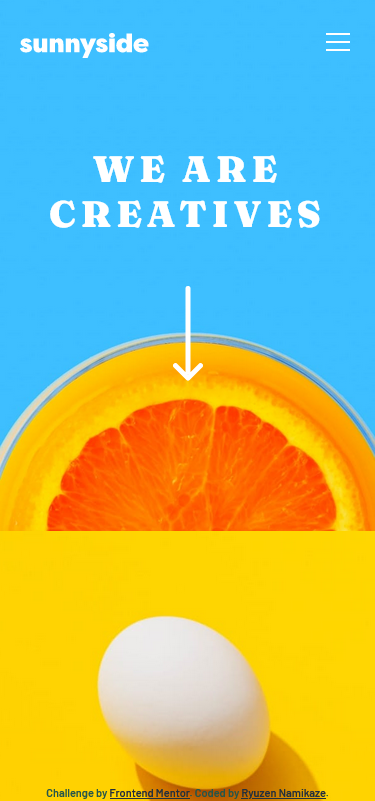

# Frontend Mentor - Sunnyside agency landing page solution

This is a solution to the [Sunnyside agency landing page challenge on Frontend Mentor](https://www.frontendmentor.io/challenges/sunnyside-agency-landing-page-7yVs3B6ef). Frontend Mentor challenges help you improve your coding skills by building realistic projects.

## Table of contents

- [Overview](#overview)
  - [The challenge](#the-challenge)
  - [Screenshot](#screenshot)
  - [Links](#links)
- [My process](#my-process)
  - [Built with](#built-with)
- [Author](#author)

## Overview

### The challenge

Users should be able to:

- View the optimal layout for the site depending on their device's screen size
- See hover states for all interactive elements on the page

### Screenshot

### Links

- Solution URL: [Vercel](https://your-solution-url.com)

## My process

### Built with

- Flexbox
- CSS Grid
- FontAwesome [FontAwesome](https://fontawesome.com/)

## Author

- Website - [Yusuf Bagus](https://crdrgn.site)
- Frontend Mentor - [@rnamikaze](https://www.frontendmentor.io/profile/rnamikaze)
- Twitter - [@ryuzen_namikaze](https://www.twitter.com/ryuzen_namikaze)